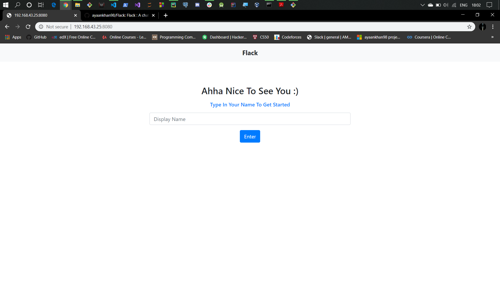
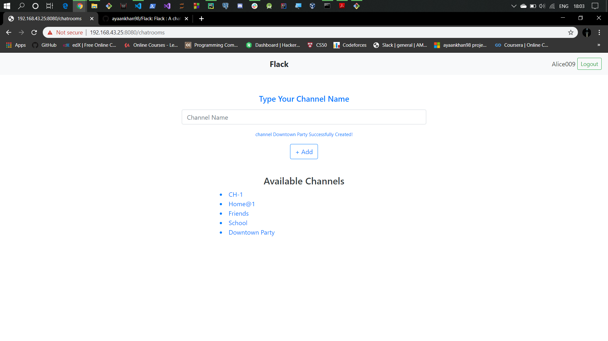
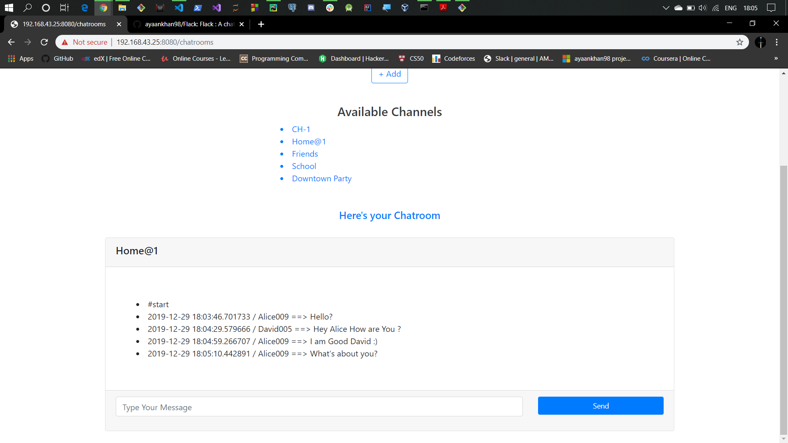

# Flack
FLack is a web based chatting application where users can signin freely and join channels and even create
their own channels in order to have conversation.







## Installation
download the repository using
```bash
git clone https://github.com/ayaankhan98/Flack.git
```

Copy the repository in the Python Virtual Environment

```bash
cd Flack
```
```bash
pip install -r requirements.txt
```

after the installation of all the necessary files set the executable application using the command
For windows --
```bash
set FLASK_APP=application.py
```

now run
```bash
flask run --no-reload
```